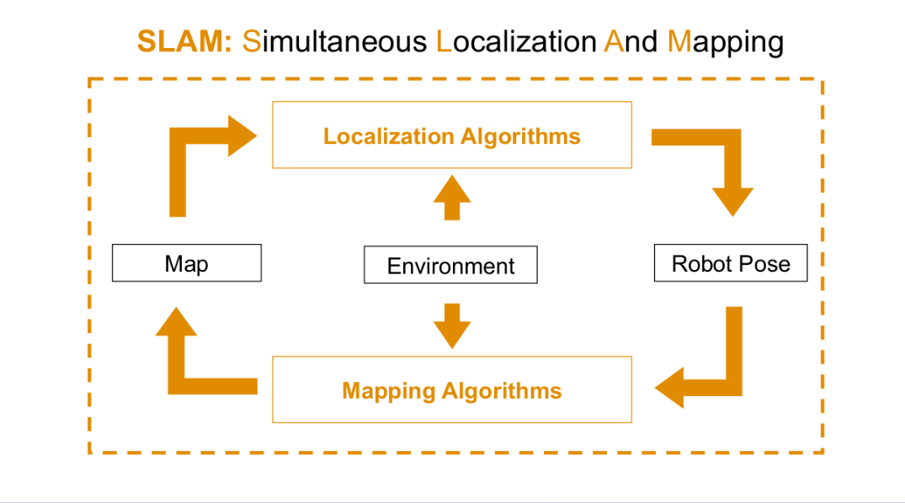
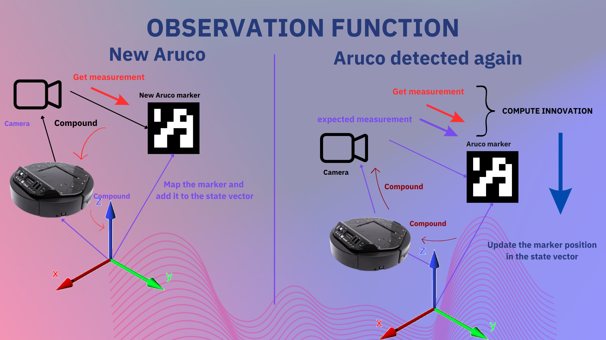

# Aruco Based Slam with Extrinsic Camera Calibration

This repository contains the implementation of Aruco marker based EKF slam from scratch. Dead reckoning is obtained from differential drive model of the robot and the correction data is obtained from identification of Aruco markers using a camera, which act as a feature.

In addition, the implementation also performs extrinsic camera localization to minimize the error in measuring the camera position relative to the robot base.

Also using sensor fusion i,e, using IMU for accurate orientation of the robot.

# SLAM

  

# Motion Model

Motion Model = [x, y,  z, θ]

# Dead Reckoning

Dead Reckoning:
                        
    Xₖ = Xₖ₋₁  + ∆X
    Yₖ = Yₖ₋₁  + ∆Y
    θₖ  = θₖ₋₁ + ∆θ 
    Pₖ = Aₖ P Aₖ.T + Wₖ Qₖ Wₖ.T
    Aₖ and Wₖ are the derivative of the new state w.r.t. the
    state and noise respectively.
    
    Uncertainty gets accumulated with time.

# Sensor measurement
Measurement:

    h(x)  = h(ⁿXᵣ , ʳX𝒸, ᶜXₐ, Vₖ)
    h(x) = ( ᶜXᵣ ⊞ (Θ(ⁿXᵣ ) ⊞ ⁿXₐ)) =  ᶜXₐ

# EKF update using dead reckoning and sensor measurement

EKF Update:

    Hₖ = dh(Xₖ,Vₖ)/dxₖ
    Vₖ =  dh(Xₖ,Vₖ)/dvₖ

    Kₖ = Pₖ  Hₖ.T (Hₖ Pₖ Hₖ.T  +  
                                Vₖ Pₖ Vₖ.T) -1
    Xₖ = Xₖ₋₁ + Kₖ(Zₖ - h(Xₖ,0))
    Pₖ = (I - Kₖ Hₖ) Pₖ (I - Kₖ Hₖ).T

# Observation Function

  

# Videos: Please check the Videos folder for the video demonstration.
